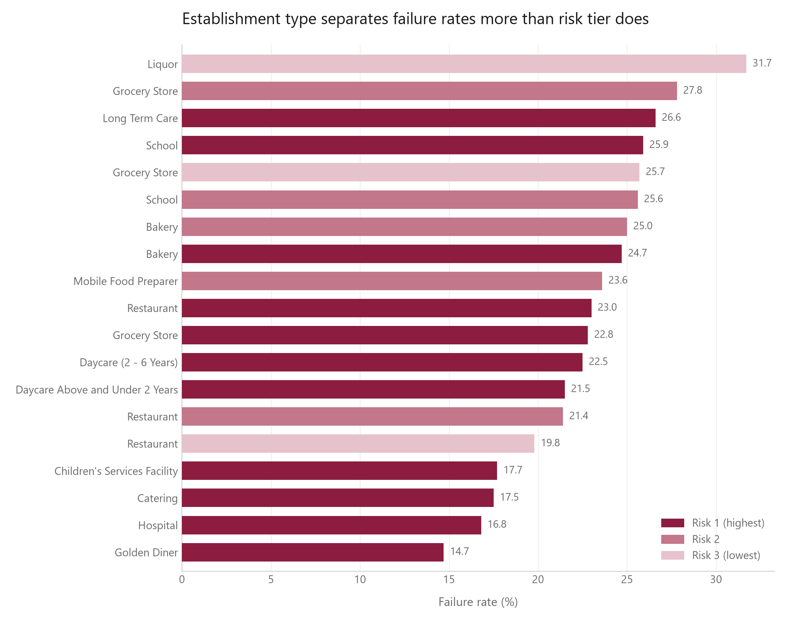
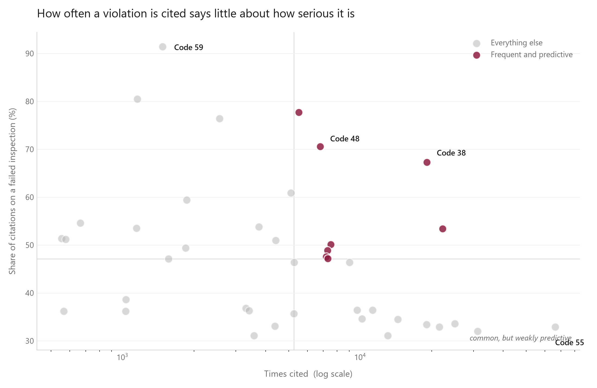

# Chicago Food Inspections: Does the City's Risk Tier Predict Anything?

An end-to-end analysis of 315,223 Chicago Department of Public Health food safety inspections, built to answer one question: **does the risk level the city assigns an establishment before the inspector arrives actually predict whether it will fail, or how fast it will recover if it does?**

Short answer: barely, and not at all, respectively.

---

## The question

Chicago rates every food establishment Risk 1, 2, or 3 before any inspection happens. Risk 1 places get inspected most often. The obvious assumption is that Risk 1 means "more likely to have problems."

This project tests that assumption two ways: by comparing failure rates across tiers, and by measuring how quickly establishments recover after a failure.

## Data

- **Source:** [Chicago Food Inspections](https://data.cityofchicago.org/Health-Human-Services/Food-Inspections/4ijn-s7e5), City of Chicago Open Data Portal
- **Raw:** 315,223 inspection records
- **Analyzed:** 115,495 records from January 2020 onward, plus 373,371 individual violations parsed out of a free-text field
- The raw CSV is not committed (several hundred MB). `src/01_download.py` fetches it.

---

## What was wrong with the data

Documented in full in [`notes/data-quality-findings.md`](notes/data-quality-findings.md). The five that changed the analysis:

**One value packed into many rows.** The `Violations` column stores an unlimited number of separate violations in a single pipe-delimited string, each prefixed with a numeric code and followed by the inspector's free-text comments after a `- Comments:` marker. In that form it cannot be counted, grouped, or joined. Parsing it produced a normalized child table of 373,371 rows keyed to `inspection_id`, which is what makes every violation-level query in this repo possible. The delimiter has inconsistent whitespace, so the split uses a regex pattern rather than a fixed string.

**16% of rows are not inspection outcomes.** Alongside Pass (56,324), Fail (22,178), and Pass w/ Conditions (18,228), the `Results` column contains Out of Business (8,531), No Entry (7,558), Not Ready (2,652), and Business Not Located (24). These are the inspector reporting they could not inspect. Leaving all 18,765 in the denominator understates the overall failure rate by roughly 4 percentage points.

**Placeholder values that pass a null check.** `License #` has only 19 true nulls, but 831 rows carry a literal `0`. These read as populated while carrying no identifying information. Because the re-inspection analysis partitions by license number, leaving them in would treat every affected row as one artificial establishment. Among the restaurant rows with a placeholder license, 51 of 192 categorized inspections were re-inspections, meaning those establishments have a prior failure that cannot be linked to its follow-up. Coerced to null during cleaning.

**94 spellings of one city.** `City` is uncontrolled free text: `CHICAGO`, `Chicago`, `chicago`, `CCHICAGO`, `CHICAGOO`, `CHICAGOCHICAGO`, `CHICAGO.`. Rather than hand-mapping ninety variants, normalization uppercases, strips whitespace, and collapses anything containing the substring `CHICAGO`. That single rule caught every misspelling, leaving 115,304 Chicago rows and a genuine tail of 191 suburban records.

**Uncontrolled categories.** `Facility Type` is free text with inconsistent casing and overlapping values (`CHURCH` and `CHURCH/SPECIAL EVENTS` coexist as distinct categories), so any aggregation by establishment type is approximate rather than exact.

**Two things that were checked and turned out fine.** `Inspection ID` is genuinely unique, with zero duplicates. Every one of the 315,223 dates parsed. Both checks are kept in the code so the assumptions are verified rather than assumed.

---

## Findings

### 1. Establishment type separates failure rates far more than risk tier does



Holding establishment type constant, the risk tier does work in the expected direction. Restaurants fail at **23.0%, 21.4%, and 19.8%** across Risk 1, 2, and 3, monotonically. But the effect is small, 3.2 percentage points, and it is swamped by what kind of business you are: the *lowest*-risk liquor stores fail at **31.7%**, well above the *highest*-risk restaurants.

Restaurants appear in all three tiers, which means the tier is not a property of the business category. It is assigned per establishment.

> Query: [`sql/01_pass_fail_by_facility_type.sql`](sql/01_pass_fail_by_facility_type.sql)

### 2. How often a violation is cited says little about how serious it is



Code 55 (physical facilities installed, maintained, clean) is the most-cited violation in the dataset at **66,589 occurrences**, and it appears on a failed inspection only about a third of the time. It is nearly uninformative. Code 38 (insects, rodents, animals not present) is cited **19,094 times** and coincides with failure **67.3%** of the time: both common and predictive, a rare combination.

Sorting by count would have surfaced the uninformative violation and buried the predictive one.

The strongest single signal is codes 59 and 60, "PREVIOUS ... VIOLATION CORRECTED," at **91.4%** and **77.7%**. These are written only where a prior violation exists, so they mark establishments with a history. The specific earlier problem was fixed, and the establishment failed anyway on other grounds. I tested whether this was an artifact of these codes appearing only on re-inspections and it was not: routine Canvass visits account for the plurality of citations, 3,813 of roughly 7,021.

> Query: [`sql/02_top_violations_on_failures.sql`](sql/02_top_violations_on_failures.sql)

### 3. Recovery after failure is fast, near-universal, and completely flat across risk tiers

**87.4%** of failed establishments passed their next inspection, at an average of **14.4 days**. Of 22,178 failures, 21,714 had a subsequent inspection, so almost nothing falls through the follow-up system.

Broken out by tier, the recovery rate is 87.3%, 87.6%, and 87.6%. That is a flat line. Time to the next inspection is likewise 14.3, 13.9, and 16.5 days, a spread small enough to be noise on a two-week cycle.

The city is not prioritizing high-consequence establishments for faster follow-up, and high-consequence establishments are not harder to bring into compliance.

> Query: [`sql/03_reinspection_outcomes.sql`](sql/03_reinspection_outcomes.sql)

### Putting it together

The risk tier predicts failure weakly and recovery not at all. Both findings point the same direction: **the tier encodes the consequence of a food safety failure, not the likelihood of one.** A hospital kitchen is Risk 1 because contamination there would be catastrophic, not because hospitals are dirty. Hospitals fail at 16.8%, one of the lowest rates in the dataset.

---

## Method notes

**Pass w/ Conditions counts as a pass** throughout. The establishment stayed open. Grouping it with failures instead would change every rate reported here; the choice is applied consistently across all three queries.

**Why a window function.** Measuring whether an establishment recovered requires comparing one inspection to the *next one at the same establishment*. `GROUP BY` collapses exactly the rows that need to stay separate. `LEAD() OVER (PARTITION BY license ORDER BY inspection_date)` reaches forward one row within each establishment's chronological history. The query wraps it in a CTE because a window function cannot be referenced in `WHERE`, which is evaluated before the window is computed.

**Why indexes.** The violations join runs across 373,371 rows against 115,495. Indexes on `inspections(license)`, `inspections(inspection_date)`, and `violations(inspection_id)` are created explicitly in `04_load_db.py`.

**Why 2020 onward.** The full dataset reaches back to 2010. Filtering to 2020+ keeps the analysis about the current inspection regime and cuts 63% of the rows. This is a deliberate scope choice, not a data quality drop, and it means nothing here speaks to the pre-2020 baseline.

---

## Limitations

- **Nothing here is causal.** Code 38 does not cause failure; it co-occurs with it. An inspection that finds rodents almost certainly finds other problems too.
- **This data tracks inspections, not illness.** No one getting sick appears anywhere in it.
- **Inspection counts reflect where inspectors went,** not where problems are. A neighborhood with more inspections is not necessarily worse.
- **`Facility Type` is uncontrolled text,** so every grouping by establishment type is approximate.
- **SQLite has no `MEDIAN` function,** so days-to-next-inspection is reported as a mean and is sensitive to long tails.
- **728 of 373,371 violations carry no inspector comments,** so the comments field cannot be treated as complete.

## What I would do next

1. Join census tract data to test whether geographic patterns survive controlling for inspection frequency, which would separate a neighborhood effect from an inspector-routing effect.
2. Model failure probability from the violation history of the establishment's prior inspections, since findings 2 and 3 together suggest prior violations carry real predictive weight.
3. Compare the 2020+ window against 2010 to 2019 to establish whether any of this is a trend or a level.

---

## Running it

```bash
python -m venv .venv && source .venv/bin/activate    # Windows: .\.venv\Scripts\Activate.ps1
pip install -r requirements.txt
python src/01_download.py     # fetches the raw CSV (several hundred MB)
python src/03_clean.py        # writes inspections.parquet and violations.parquet
python src/04_load_db.py      # builds the SQLite database with indexes
python src/05_analyze.py      # runs all SQL, writes outputs/tables and outputs/figures
```

## Structure

```
src/         pipeline: download, profile, clean, load, analyze
sql/         the three analysis queries, each with a comment block on what it answers
notes/       data quality findings from the profiling pass
outputs/     query results as CSV, figures as PNG
data/        raw and processed data (gitignored, rebuildable)
```

The SQLite database is not committed. It is fully reproducible from the scripts above.
